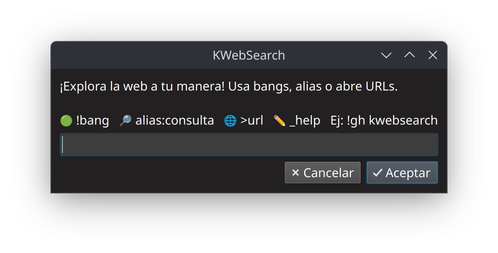

<div align="center">
  
</div>

# 📘 KWebSearch — Buscador gráfico personalizado para KDE

**Versión:** 1.4  
**Autor:** dmnmsc  
**Licencia:** [GNU General Public License v3.0](https://www.gnu.org/licenses/gpl-3.0.html)  
**Entorno recomendado:** KDE Plasma con kdialog  
**Idioma:** Español

---


## 🎯 ¿Qué es?


KWebSearch es un script Bash con interfaz gráfica que te permite hacer búsquedas rápidas en internet usando comandos cortos llamados alias. Está pensado para usuarios de KDE que quieren buscar en Google, Wikipedia, YouTube, GitHub, y muchos otros sitios sin abrir el navegador primero.

Es compatible con `!bangs` de DuckDuckGo, como `!g` para buscar en Google o `!yt` para buscar en YouTube. Además, permite abrir sitios web directamente usando un prefijo configurable (por defecto el símbolo `>`).

Puedes crear tus propios alias, usar comandos especiales para ver el historial, hacer backups, y más, todo desde ventanas gráficas fáciles de usar.

---

## TL;DR

KWebSearch es un buscador rápido con interfaz gráfica para KDE que usa alias personalizables, soporta los bangs de DuckDuckGo y permite abrir URLs directamente con un prefijo configurable.


---

## ⚙️ Características principales

- 🔎 Alias personalizados para búsquedas rápidas en diferentes servicios web  
- 🧠 Compatible con los bangs de DuckDuckGo para ampliar opciones de búsqueda (`!g`, `!yt`, `!aur`, etc.)
- 🌐 Permite abrir URLs directamente con un prefijo configurable (por defecto `>`)  
- 🔄 Menú principal con acceso a todas las funciones  
- ✏️ Crear, editar y gestionar alias desde interfaz gráfica sin tocar archivos  
- 🕘 Historial con selector visual para consultar o repetir búsquedas previas  
- 🧹 Limpieza del historial desde la propia interfaz  
- 📤 Exportación y respaldo automático de configuración e historial  
- 📥 Restauración gráfica de copias de seguridad guardadas  
- 🆕 Comandos especiales como `_about`, `_help`, `_prefix` y más para facilitar el uso  

---

## 🚀 Instalación

```bash
git clone https://github.com/dmnmsc/kwebsearch.git
cd kwebsearch
chmod +x kwebsearch.sh
./kwebsearch.sh
```
 📝 El script creará automáticamente el archivo `kwebsearch.conf` con todos los alias por defecto.

---

## 💡 Sugerencia: Asigna un atajo de teclado

Para invocar KWebSearch con mayor rapidez, se recomienda asignar un **atajo de teclado personalizado** que ejecute el script desde cualquier parte del sistema.

### En KDE Plasma:

1. Abre la app **Preferencias del sistema** → sección **Accesos rápidos**.  
2. Ve a **Accesos rápidos personalizados** → selecciona "Editar".  
3. Crea una nueva acción:  
   - **Nombre:** `KWebSearch`  
   - **Acción/Comando:** `/ruta/completa/a/kwebsearch.sh`  
   - **Acceso rápido:** elige una combinación libre, como `Meta + W` 🔁  
4. Guarda y prueba el acceso rápido.

Esto convierte tu script en una herramienta instantánea, accesible desde cualquier ventana o escritorio, sin necesidad de abrir una terminal.

> 🧠 También puedes vincularlo a un botón físico si usas dispositivos como StreamDeck, teclados programables o gestos en tu panel táctil.

---

## 🔧 Alias incluidos

Al iniciar `kwebsearch.sh` por primera vez, se crea un archivo de configuración (`kwebsearch.conf`) con una selección de alias listos para búsquedas rápidas en servicios populares.  

Cada alias es un identificador corto que puedes escribir antes de tu búsqueda para dirigir la consulta al sitio correspondiente.

| Alias | Servicio             | Descripción              | Ejemplo de uso                              |
|-------|----------------------|--------------------------|---------------------------------------------|
| p     | Perplexity.ai        | Búsqueda con IA          | `p:inteligencia artificial`                 |
| g     | Google               | Búsqueda clásica         | `g:cómo funciona el hidrógeno verde`        |
| .g    | Google Shopping      | Productos                | `.g:smartwatch deporte`                     |
| i     | Google Imágenes      | Búsqueda visual          | `i:noche estrellada`                        |
| y     | YouTube (PWA)        | Vídeos                   | `y:linux tutorial español`                  |
| w     | Wikipedia (ES)       | Español                  | `w:teoría cuántica`                         |
| .w    | Wikipedia (EN)       | Inglés                   | `.w:quantum theory`                         |
| k     | Kimovil              | Comparar móviles         | `k:xiaomi redmi note 12`                    |
| .k    | GSMArena             | Fichas técnicas          | `.k:samsung galaxy s23 ultra`               |
| a     | Amazon               | Productos en España      | `a:disco duro ssd externo`                  |
| .a    | Amazon (Incógnito)   | Navegador Chromium       | `.a:raspberry pi 5`                         |
| d     | RAE                  | Diccionario español      | `d:resiliencia`                             |
| .d    | WordReference        | Sinónimos en español     | `.d:rápido`                                 |
| c     | DIEC (IEC)           | Diccionario catalán      | `c:llibertat`                               |
| .c    | SoftCatalà           | Sinónimos en catalán     | `.c:bonic`                                  |
| e     | WordReference (EN)   | Definiciones inglés      | `e:tired`                                   |
| .e    | WordReference        | Sinónimos inglés         | `.e:fast`                                   |
| aur   | AUR (Arch Linux)     | Paquetes comunitarios    | `aur:kdialog`                               |
| gh    | GitHub               | Repositorios             | `gh:mpv`                                    |
| trans | Google Translate     | Traducción automática    | `trans:I won't give up`                     |


> **ℹ️ Puedes consultar la lista completa de alias con el comando especial `_alias` o revisando el archivo `kwebsearch.conf`.**
> 
## ⚙️ Personalización avanzada de alias

Puedes adaptar `kwebsearch.sh` a tus necesidades agregando, modificando o eliminando alias **desde la interfaz gráfica** del propio script, sin editar archivos manualmente.  

Cada alias tiene tres componentes: **nombre**, **descripción** y **URL de búsqueda** (donde `$query` será reemplazado por lo que busques).

### ➕ ¿Cómo crear o editar alias?

1. **Usa el comando especial:**  
   Escribe `_newalias` para crear uno nuevo, o `_edit` para modificar uno existente.

2. **Completa los campos en el diálogo gráfico:**  
   - **Alias**: palabra corta (ejemplo: `eco`)
   - **Descripción**: indica a qué sitio corresponde (`Ecosia`)
   - **URL**: dirección de búsqueda, usando `$query` como marcador  

     Ejemplo para Ecosia:  
     ```
     https://www.ecosia.org/search?q=$query
     ```

3. **Guarda y prueba el nuevo alias:**  
   Escribe `eco:github` en la ventana principal.
---

## 🛠️ Comandos especiales

| Comando         | Función                                      |
|-----------------|----------------------------------------------|
| `_menu` 🔄      | **Nuevo nombre del menú principal**          |
| `_alias`        | Selector visual de alias                     |
| `_newalias`     | Crear alias desde interfaz                   |
| `_edit`         | Editar alias manualmente                     |
| `_default`      | Establecer alias por defecto                 |
| `_resetalias`   | Restablecer alias por defecto a DuckDuckGo   |
| `_history`      | Ver historial de búsquedas                   |
| `_clear`        | Borrar historial completo                    |
| `>` 🆕          | Abrir directamente una URL en el navegador   |
| `_prefix` 🆕    | Cambiar el prefijo que activa la apertura directa de URLs  |
| `_backup`       | Crear copia de seguridad                     |
| `_restore`      | Restaurar una copia anterior                 |
| `_help`         | Mostrar ayuda integrada                      |
| `_about` 🆕     | Ver información de versión y autoría         |
| `_exit`         | Salir del script                             |

---

## 📂 Estructura de archivos

- `~/kwebsearch/`  
  - `kwebsearch.conf` → Archivo principal de alias  
  - `kwebsearch_backup_YYYY-MM-DD_HH-MM-SS/` → Copias de seguridad  
- `~/.kwebsearch_history` → Historial de consultas realizadas

---

## 🛡️ Licencia

Este proyecto está licenciado bajo la **GNU General Public License v3.0**

Puedes ver el texto completo en [`LICENSE.md`](./LICENSE.md) o visitar el sitio oficial:  
🔗 https://www.gnu.org/licenses/gpl-3.0.html

> El código fuente, así como cualquier versión modificada o distribuida, debe mantenerse como código abierto bajo esta misma licencia.
